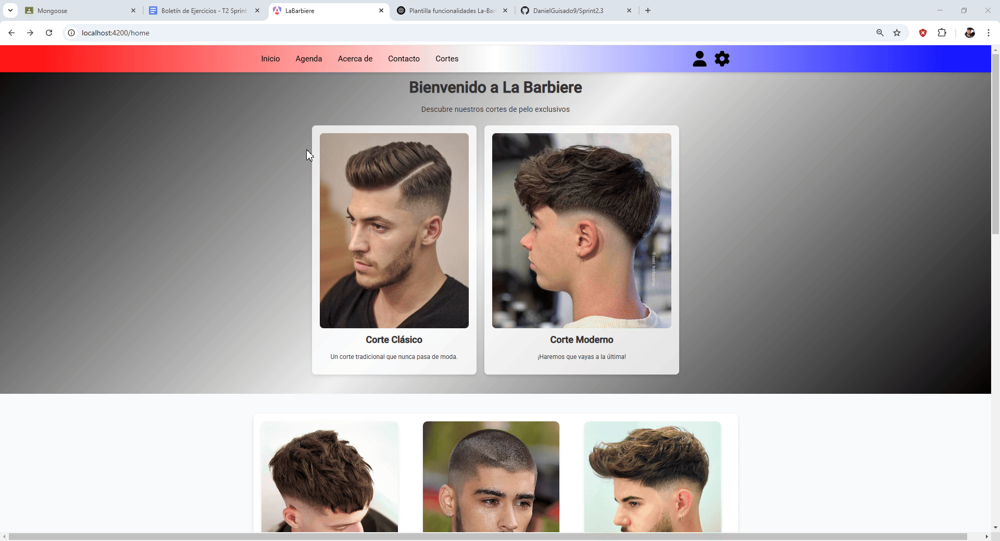
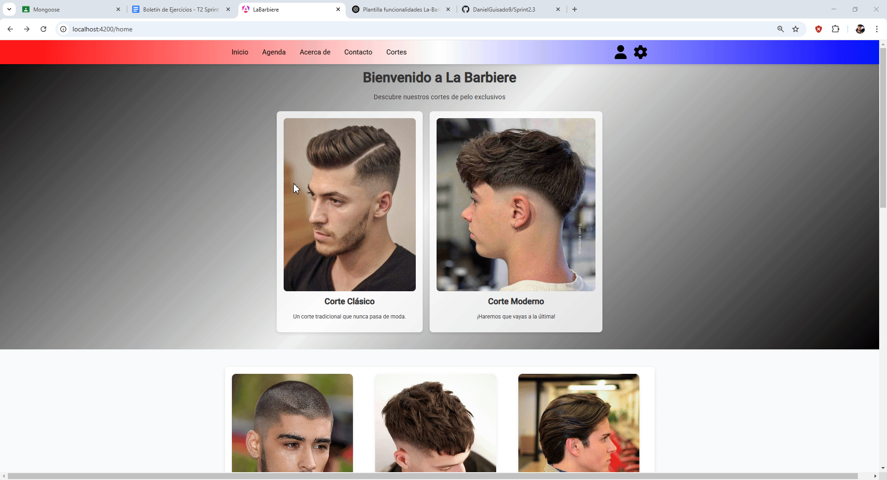
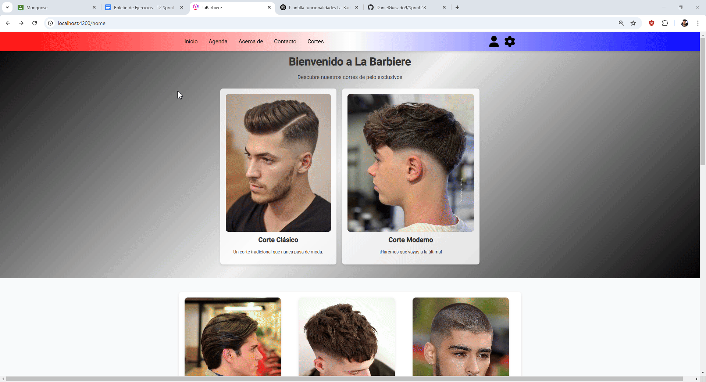

# Ejercicio1
## Análisis del problema
📌 Ejercicio 1: Perfeccionamiento de la implementación de una Web del Tiempo con la API de AEMET
🎯 Contexto
El objetivo de este ejercicio es desarrollar una aplicación web del tiempo que permita a los usuarios consultar información meteorológica de diferentes ubicaciones de España, utilizando la API de AEMET (Agencia Estatal de Meteorología).

La interfaz estará inspirada en la web de https://www.eltiempo.es/sevilla.html, proporcionando datos detallados como:
Estado actual del tiempo.
Pronóstico por horas y días.
Mapa meteorológico interactivo.
Índices de calidad del aire y avisos meteorológicos.
⚙️ Requerimientos Funcionales
1️⃣ Mapa meteorológico interactivo
Mapa con capas de temperatura, lluvia y viento.
Capacidad para seleccionar diferentes tipos de datos.
2️⃣ Personalización de la vista
Cambio de tema claro/oscuro para todo el aplicativo.

🔗 Documentación de la API de AEMET
Para obtener los datos meteorológicos, se utilizará la API de AEMET, que proporciona información detallada sobre el clima en tiempo real y pronósticos.
Registro y obtención de API Key:
Acceder a AEMET API y obtener la clave de acceso.
Usar POSTMAN para verificar manualmente la llamada al endpoint.
Seguir la documentación de SWAGGER:
Acceder a AEMET API SWAGGER para obtener toda la información relevante a volcar en Postman para verificar el correcto funcionamiento de nuestra petición.

## Diseño de la propuesta de solución del problema

## Pruebas de la resolución del problema

 

# Ejercicio2
## Historias de Usuario
🔸 Historia de Usuario 1
- Funcionalidad 1: Sistema de filtrado y búsquedas 
✏️ Título: Búsqueda y Filtrado de Productos y Servicios

📝 Descripción:
"Como usuario, quiero poder buscar productos y servicios para encontrar rápidamente lo que necesito".

🔸 Criterios de Aceptación:

Dado que el usuario ingresa un término en la barra de búsqueda, el sistema deberá mostrar resultados relevantes en tiempo real.
Cuando el usuario realiza una búsqueda y no hay coincidencias, se deberá mostrar un mensaje indicando que no hay resultados.
Entonces, la búsqueda deberá ser eficiente y mostrar los resultados en menos de 2 segundos.

🔸 Criterios de Aceptación:

Dado que el usuario selecciona una o varias opciones de filtrado, los resultados deberán actualizarse dinámicamente.
Cuando el usuario combina varios filtros, la búsqueda deberá reflejar solo los productos que cumplan con todas las condiciones aplicadas.
Entonces, los filtros deberán aplicarse en menos de 2 segundos para garantizar una experiencia fluida.

🔸 Criterios de Aceptación:

Dado que hay más resultados de los que pueden mostrarse en una sola página, el sistema deberá dividirlos en varias páginas con controles de navegación.
Cuando el usuario cambia de página, los nuevos resultados deberán cargarse sin afectar el rendimiento de la web.
Entonces, la navegación entre páginas deberá ser rápida y sin interrupciones, asegurando que el usuario pueda encontrar fácilmente lo que busca.

🔸 Historia de Usuario 2
- Funcionalidad 2: Sistema de perfil de usuario
✏️ Título: Sistema de perfil de usuario

📝 Descripción:
"Como usuario, quiero poder acceder a mi perfil desde la barra de navegación para poder ver mi información personal".

🔸 Criterios de Aceptación:

Dado que el usuario hace clic en el icono de usuario, se deberá desplegar un menú con opciones.
Cuando el usuario seleccione "Ver información del usuario", se mostrará una pestaña emergente con sus datos.
Entonces, el usuario podrá ver su información de manera clara y sin retrasos.

🔸 Criterios de Aceptación:

Dado que el usuario abre el menú del icono de usuario, se deberá mostrar la opción "Cerrar sesión".
Cuando el usuario haga clic en "Cerrar sesión", su sesión deberá cerrarse correctamente y redirigirlo a la página de inicio.
Entonces, la sesión se cerrará de manera segura y sin errores.

🔸 Criterios de Aceptación:

Dado que el usuario abre la pestaña de información, esta deberá mostrar nombre, teléfono y correo de forma clara.
Cuando el usuario interactúe con la pestaña, esta no deberá interferir con el resto de la navegación.
Entonces, la pestaña emergente deberá cerrarse correctamente al hacer clic fuera de ella o presionar "Cerrar".

🔸 Historia de Usuario 3
- Funcionalidad 3: Sistema de reserva con promociones y descuentos
✏️ Título: Sistema de reserva con promociones y descuentos

📝 Descripción:
"Como usuario, quiero ver las promociones disponibles en la página de inicio para poder reservar una cita con descuento".

🔸 Criterios de Aceptación:

Dado que el usuario accede a la página de inicio, deberá visualizar una sección con las promociones activas.
Cuando el usuario seleccione una promoción, se mostrará la descripción y los detalles de la oferta.
Entonces, el usuario podrá decidir si quiere aprovechar la promoción y reservarla.

🔸 Criterios de Aceptación:

Dado que el usuario hace clic en "Aprovechar oferta", se deberá abrir una pestaña emergente con un formulario.
Cuando el usuario ingrese sus datos y haga clic en "Reservar", la información deberá enviarse al sistema correctamente.
Entonces, el usuario recibirá una confirmación indicando que su reserva fue exitosa.

🔸 Criterios de Aceptación:

Dado que el usuario completa el formulario de reserva, el sistema deberá validar que todos los campos estén completos.
Cuando la reserva se envíe correctamente, se mostrará un mensaje de confirmación.
Entonces, el usuario podrá estar seguro de que su promoción ha sido registrada y podrá utilizarla según los términos indicados.

## Análisis del problema
- Funcionalidad 1: Sistema de filtrado y búsquedas 
Problema que resuelve:
Los usuarios necesitan encontrar servicios y productos específicos de manera rápida y eficiente dentro de la plataforma. Actualmente, la navegación puede ser tediosa sin un sistema de búsqueda y filtrado adecuado.

Relevancia para el usuario:
Facilita la experiencia del usuario al permitirle encontrar rápidamente lo que necesita mediante criterios específicos como nombre, categoría, precio y disponibilidad.

- Funcionalidad 2: Sistema de perfil de usuario
 Problema que resuelve:
Los usuarios necesitan acceder rápidamente a su información personal y gestionar su sesión de manera intuitiva. Sin una pestaña de perfil, la navegación puede ser menos eficiente y generar confusión.

Relevancia para el usuario:
Proporciona una manera sencilla y accesible de ver la información del usuario y gestionar su cuenta desde cualquier página de la plataforma.

- Funcionalidad 3: Sistema de reserva con promociones y descuentos
Problema que resuelve:
Los usuarios necesitan conocer y aprovechar promociones especiales, así como reservarlas de manera sencilla sin necesidad de contacto directo con el establecimiento.

Relevancia para el usuario:
Facilita el acceso a descuentos y ofertas, optimizando la gestión de reservas mediante un sistema intuitivo y rápido dentro de la plataforma.

## Diseño de la propuesta de solución del problema
- Funcionalidad 1: Sistema de filtrado y búsquedas 
 Nuevo elemento integrado en el navbar,"cortes", en el que al hacer click se desplegará una pestaña con la barra de búsqueda y el desplegable de todos los estilos, y juste debajo de los dos elementos anteriores,estarán todos cortes de pelo.

- Funcionalidad 2: Sistema de perfil de usuario
Icono de usuario en la barra de navegación.
Pestaña desplegable con opciones: "Ver información del usuario" y "Cerrar sesión".
Pestaña emergente con la información del usuario.
El icono de usuario se encuentra en la barra de navegación.
Al hacer clic en el icono, se despliega un menú negro con opciones.
Al seleccionar "Ver información del usuario", aparece una pestaña blanca con los datos personales del usuario.

- Funcionalidad 3: Sistema de reserva con promociones y descuentos
Promotions: Sección en la pantalla principal (Home) donde se muestran las promociones activas.
Reserva-Promoción: Pestaña emergente que permite a los usuarios reservar una promoción ingresando sus datos.
La sección "Promociones y Ofertas Especiales" estará visible en la página de inicio.
Cada promoción incluirá un botón "Aprovechar oferta".
Al hacer clic en el botón, se abrirá la pestaña emergente de reserva con un formulario.
Tras enviar la reserva, el usuario recibirá una confirmación.
 
## Pruebas de la resolución del problema
- Funcionalidad 1: Sistema de filtrado y búsquedas 
 Se agregará una barra de búsqueda en la cabecera de la web.
 Los filtros se mostrarán en la barra lateral en la vista de productos/servicios.
 Se implementará una página de resultados con ordenamiento y paginación.
 Se reutilizarán componentes existentes como listas, tarjetas de productos, el navbar y reservas.
 La búsqueda se implementará con un campo de entrada controlado y peticiones a la API para filtrar los resultados en tiempo real.
 La información del usuario se obtendrá desde datos mockeados y se mostrará en la pestaña emergente.

- Funcionalidad 2: Sistema de perfil de usuario
 Se reutilizarán componentes de menú desplegable, modal emergente y el navbar.
 El menú desplegable se activará mediante eventos de clic en el icono de usuario.
 La información del usuario se obtendrá desde datos mockeados y se mostrará en la pestaña emergente.

- Funcionalidad 3: Sistema de reserva con promociones y descuentos
 - Promotions:
Se implementa como un componente de lista dinámico donde se cargan las promociones activas desde el backend.
Cada promoción incluye imagen, descripción, descuento y fecha de vencimiento.
Se incorpora un botón "Aprovechar oferta" que activa el modal de reserva.

 - Reserva-Promoción:
Componente modal que incluye un formulario con los campos "Nombre", "Teléfono" y "Correo".
Al hacer clic en "Reservar", los datos se envían al backend y se genera una reserva de la promoción.
Se muestra una confirmación al usuario.

## Pruebas de la resolución del problema
- Funcionalidad 1: Sistema de filtrado y búsquedas 
 - ✅ Prueba 1: Probar que los filtros funcionan correctamente.
Seleccionar un corte de pelo en el desplegable de filtros.

 

 - ✅ Prueba 2: Sistema de Búsqueda
 Probar buscando un corte de pelo específico y validar que al hacer click nos lleve a la página de reservas

 - ✅ Prueba 3: Asegurar que la paginación funciona correctamente y no repite ni omite resultados.
 Hacer scroll para validar que los datos no se cortan y que todos los datos se visualizan

 

- Funcionalidad 2: Sistema de perfil de usuario
 - ✅ Prueba 1: Verificar que al hacer clic en el icono de usuario se despliega el menú con opciones.

 

 - ✅ Prueba 2: Comprobar que al seleccionar "Ver información del usuario", aparece la pestaña blanca con los datos correctos.

 - ✅ Prueba 3: Asegurar que el menú se cierra correctamente al hacer clic fuera de él o en la cruz.

 

- Funcionalidad 3: Sistema de reserva con promociones y descuentos
 - ✅ Prueba 1: Verificar que las promociones se cargan correctamente y se visualizan en la pantalla principal.

 

 - ✅ Prueba 2: Validar que el formulario no permita envíos con campos vacíos.

 - ✅ Prueba 3: Validar que al rellenar bien los campos se visualiza la alerta de reserva confirmada

 

